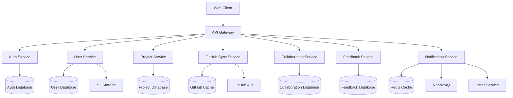
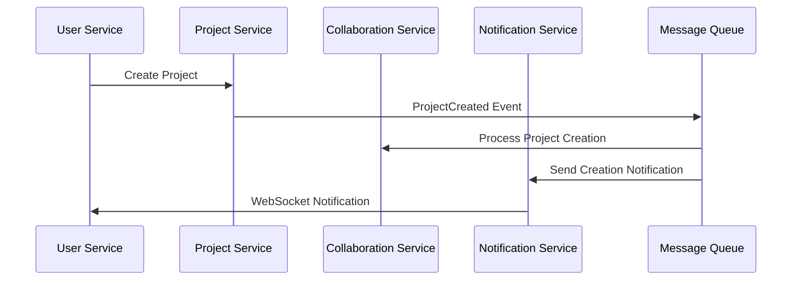

# Design Document

## Overview

SkillSync is designed as a cloud-native microservices platform that enables developers to build portfolios, collaborate on projects, and receive feedback. The architecture follows domain-driven design principles with each microservice owning its data and business logic. The system emphasizes scalability, fault tolerance, and real-time collaboration through event-driven communication patterns.

## Architecture

### High-Level Architecture



### Microservices Communication

The platform uses a hybrid communication approach:

- **Synchronous**: REST APIs for direct user-initiated operations
- **Asynchronous**: Event-driven messaging for cross-service coordination
- **Real-time**: WebSocket connections for live notifications

### Event-Driven Architecture



## Components and Interfaces

### API Gateway

**Responsibilities:**
- Request routing and load balancing
- Authentication token validation
- Rate limiting and throttling
- SSL termination
- Request/response logging

**Key Interfaces:**
- `/api/v1/auth/**` → Auth Service
- `/api/v1/users/**` → User Service
- `/api/v1/projects/**` → Project Service
- `/api/v1/github/**` → GitHub Sync Service
- `/api/v1/collaborations/**` → Collaboration Service
- `/api/v1/feedback/**` → Feedback Service
- `/ws/notifications` → Notification Service WebSocket

### Auth Service

**Responsibilities:**
- User registration and authentication
- JWT token lifecycle management
- OAuth integration (GitHub, Google)
- Password reset and security

**Data Model:**
```json
{
  "user": {
    "id": "uuid",
    "email": "string",
    "passwordHash": "string",
    "oauthProviders": ["github", "google"],
    "roles": ["user", "admin"],
    "isActive": "boolean",
    "createdAt": "timestamp",
    "lastLoginAt": "timestamp"
  }
}
```

**Key APIs:**
- `POST /auth/register` - User registration
- `POST /auth/login` - User authentication
- `GET /auth/oauth/{provider}/callback` - OAuth callback
- `POST /auth/token/refresh` - Token refresh
- `POST /auth/logout` - User logout

### User Service

**Responsibilities:**
- User profile management
- Skill cards and expertise tracking
- Profile visibility and privacy settings
- User search and discovery

**Data Model:**
```json
{
  "userProfile": {
    "id": "uuid",
    "userId": "uuid",
    "displayName": "string",
    "bio": "text",
    "location": "string",
    "website": "url",
    "profileImageUrl": "url",
    "visibility": "public|private",
    "skills": [
      {
        "name": "string",
        "proficiencyLevel": "beginner|intermediate|advanced|expert",
        "yearsOfExperience": "number"
      }
    ],
    "socialLinks": {
      "github": "url",
      "linkedin": "url",
      "twitter": "url"
    },
    "createdAt": "timestamp",
    "updatedAt": "timestamp"
  }
}
```

**Key APIs:**
- `GET /users/{id}` - Get user profile
- `PUT /users/{id}` - Update user profile
- `POST /users/{id}/skills` - Add skill card
- `GET /users/search` - Search users by skills
- `POST /users/{id}/avatar` - Upload profile image

### Project Service

**Responsibilities:**
- Project CRUD operations
- Kanban board management
- Task and label management
- Project metadata and settings

**Data Model:**
```json
{
  "project": {
    "id": "uuid",
    "ownerId": "uuid",
    "name": "string",
    "description": "text",
    "visibility": "public|private",
    "tags": ["string"],
    "technologies": ["string"],
    "repositoryUrl": "url",
    "board": {
      "columns": [
        {
          "id": "uuid",
          "name": "string",
          "position": "number",
          "tasks": [
            {
              "id": "uuid",
              "title": "string",
              "description": "text",
              "assigneeId": "uuid",
              "labels": ["string"],
              "priority": "low|medium|high",
              "dueDate": "date",
              "status": "todo|in_progress|done",
              "createdAt": "timestamp"
            }
          ]
        }
      ]
    },
    "createdAt": "timestamp",
    "updatedAt": "timestamp"
  }
}
```

**Key APIs:**
- `POST /projects` - Create project
- `GET /projects/{id}` - Get project details
- `PUT /projects/{id}` - Update project
- `DELETE /projects/{id}` - Delete project
- `POST /projects/{id}/tasks` - Create task
- `PUT /projects/{id}/tasks/{taskId}` - Update task

### GitHub Sync Service

**Responsibilities:**
- GitHub OAuth integration
- Repository metadata synchronization
- Webhook event processing
- Language statistics and commit data

**Data Model:**
```json
{
  "githubRepository": {
    "id": "uuid",
    "userId": "uuid",
    "githubId": "number",
    "name": "string",
    "fullName": "string",
    "description": "text",
    "url": "url",
    "language": "string",
    "languages": {"javascript": 75, "css": 25},
    "stars": "number",
    "forks": "number",
    "isPrivate": "boolean",
    "lastCommitAt": "timestamp",
    "syncedAt": "timestamp"
  }
}
```

**Key APIs:**
- `POST /github/sync` - Trigger repository sync
- `GET /github/repositories` - Get user repositories
- `POST /github/webhook` - GitHub webhook endpoint
- `GET /github/stats/{userId}` - Get language statistics

### Collaboration Service

**Responsibilities:**
- Collaboration invitations
- Role-based access control
- Permission management
- Team coordination

**Data Model:**
```json
{
  "collaboration": {
    "id": "uuid",
    "projectId": "uuid",
    "inviterId": "uuid",
    "inviteeId": "uuid",
    "role": "viewer|editor",
    "status": "pending|accepted|declined|revoked",
    "permissions": ["read", "write", "delete"],
    "invitedAt": "timestamp",
    "respondedAt": "timestamp",
    "expiresAt": "timestamp"
  }
}
```

**Key APIs:**
- `POST /collaborations/invites` - Send invitation
- `POST /collaborations/invites/{id}/accept` - Accept invitation
- `POST /collaborations/invites/{id}/decline` - Decline invitation
- `GET /collaborations/projects/{projectId}` - Get project collaborators
- `DELETE /collaborations/{id}` - Revoke collaboration

### Feedback Service

**Responsibilities:**
- Feedback and review management
- Rating system
- Content moderation
- Feedback analytics

**Data Model:**
```json
{
  "feedback": {
    "id": "uuid",
    "projectId": "uuid",
    "authorId": "uuid",
    "content": "text",
    "rating": "number",
    "isModerated": "boolean",
    "moderationStatus": "approved|flagged|rejected",
    "tags": ["string"],
    "createdAt": "timestamp",
    "updatedAt": "timestamp"
  }
}
```

**Key APIs:**
- `POST /feedback` - Submit feedback
- `GET /feedback/projects/{projectId}` - Get project feedback
- `PUT /feedback/{id}` - Update feedback
- `POST /feedback/{id}/moderate` - Moderate feedback
- `GET /feedback/analytics/{projectId}` - Get feedback analytics

### Notification Service

**Responsibilities:**
- Real-time WebSocket notifications
- Email notification delivery
- Notification preferences
- Event processing and routing

**Data Model:**
```json
{
  "notification": {
    "id": "uuid",
    "userId": "uuid",
    "type": "mention|invitation|feedback|project_update",
    "title": "string",
    "message": "text",
    "data": "json",
    "isRead": "boolean",
    "deliveryMethod": "websocket|email|both",
    "createdAt": "timestamp",
    "readAt": "timestamp"
  }
}
```

**Key APIs:**
- `GET /notifications` - Get user notifications
- `PUT /notifications/{id}/read` - Mark as read
- `POST /notifications/preferences` - Update preferences
- WebSocket endpoint: `/ws/notifications`

## Data Models

### Database Strategy

Each microservice maintains its own database to ensure loose coupling:

- **Auth Service**: PostgreSQL for ACID compliance and user security
- **User Service**: PostgreSQL for structured profile data
- **Project Service**: PostgreSQL for relational project data
- **GitHub Sync Service**: MongoDB for flexible repository metadata
- **Collaboration Service**: PostgreSQL for transactional integrity
- **Feedback Service**: MongoDB for flexible feedback content
- **Notification Service**: Redis for fast notification delivery

### Cross-Service Data Consistency

The platform uses eventual consistency through event sourcing:

1. **Domain Events**: Services publish events when data changes
2. **Event Store**: Central event log for audit and replay
3. **Projections**: Read models updated asynchronously
4. **Saga Pattern**: Distributed transaction coordination

## Error Handling

### Error Response Format

```json
{
  "error": {
    "code": "VALIDATION_ERROR",
    "message": "Invalid input provided",
    "details": [
      {
        "field": "email",
        "message": "Email format is invalid"
      }
    ],
    "timestamp": "2024-01-01T00:00:00Z",
    "traceId": "uuid"
  }
}
```

### Circuit Breaker Pattern

Services implement circuit breakers for external dependencies:

- **Closed**: Normal operation, requests pass through
- **Open**: Failures detected, requests fail fast
- **Half-Open**: Testing recovery, limited requests allowed

### Retry Strategies

- **Exponential Backoff**: For transient failures
- **Dead Letter Queue**: For persistent failures
- **Timeout Configuration**: Per-service timeout limits

## Testing Strategy

### Unit Testing

- **Coverage Target**: 80% code coverage minimum
- **Framework**: JUnit 5 with Mockito for Spring Boot services
- **Test Categories**: Service layer, repository layer, utility functions

### Integration Testing

- **Database Testing**: Testcontainers for database integration
- **API Testing**: MockMvc for REST endpoint testing
- **Message Testing**: Embedded RabbitMQ for event testing

### Contract Testing

- **Consumer-Driven Contracts**: Pact framework for API contracts
- **Schema Validation**: JSON Schema validation for event contracts
- **Backward Compatibility**: API versioning strategy

### End-to-End Testing

- **Test Environment**: Docker Compose with all services
- **Test Data**: Automated test data generation and cleanup
- **User Journeys**: Critical path testing automation

### Performance Testing

- **Load Testing**: JMeter for API performance testing
- **Stress Testing**: Gradual load increase to find breaking points
- **Monitoring**: Application metrics during testing

### Security Testing

- **Authentication Testing**: JWT token validation and expiration
- **Authorization Testing**: Role-based access control verification
- **Input Validation**: SQL injection and XSS prevention testing
- **Dependency Scanning**: Automated vulnerability scanning